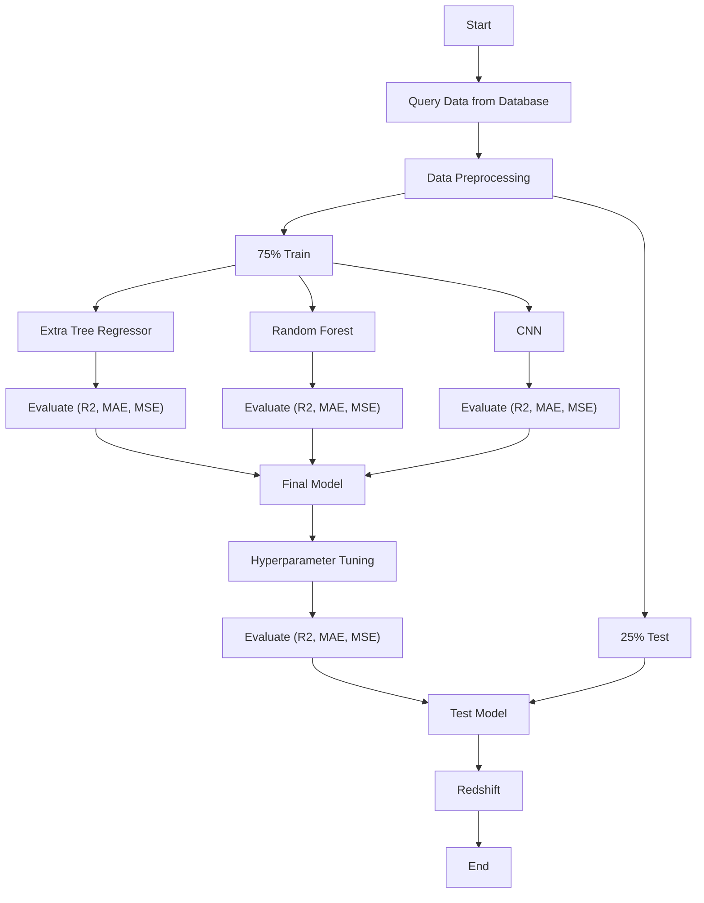

# Photometric Redshift Estimation Using Regression

  Redshift estimation using spectroscopic methods is constrained by high time consumption and computational costs. To overcome these limitations, a regression approach was implemented utilizing Extra Trees Regressor, Random Forest, and CNN algorithms. To optimize model performance, hyperparameter tuning was conducted using a genetic algorithm and random search.

## Data Collection

* The SDSS data is gathered by SQL query on https://skyserver.sdss.org/dr18/SearchTools/sql

## Stack

Python (Scikitlearn, PyTorch)

## Methods

## Project Member
- Aldiansyah Anugrah Ramadhan
- Muhammad Rizaldi Yani Hidayatulloh
- Gia Muhammad Agusta
- Giovaldi Ramadhan
