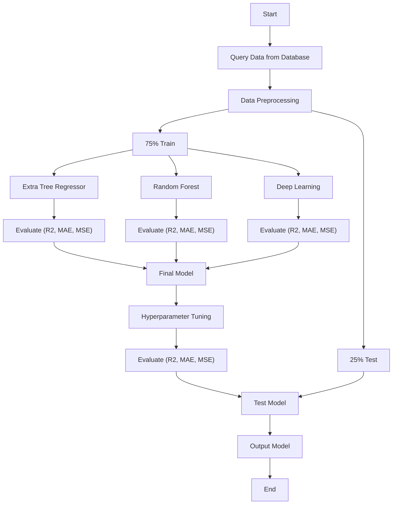

## Project Details: 
1. Team Members:
Aldiansyah Anugrah Ramadhan, Gia Muhammad Agusta, Giovaldi Ramadhan,  Muhammad Rizaldi Yani H.

2. Data Source: SDSS Data Release 18

3. Method:

Notes
* Data Preprocessing (filtering zWarning = 0, excluding the 'Star' class, handling outliers, filtering color index, train test split)
* Deep Learning (Deep Convolutional Neural Network)
* Hyperparameter Tuning (Random Search and Genetic Algorithm)
* Output Model (Redshift)

4. ML Category: Supervised Learning (Regression) 

5. Task Assignments: \\
a. Medium Story: Rizaldi and Gia \\
b. YouTube video: All members \\
c. Git code: Aldi \\
d. OSF Presentation slides: Giovaldi
